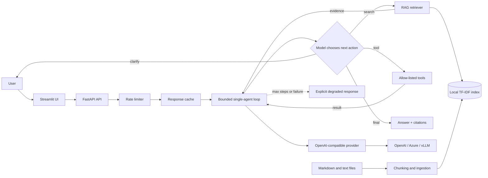

# Architecture

## Request flow

1. The API validates the request and applies a per-client sliding-window rate limit.
2. The service checks its TTL cache and starts a bounded agent loop with compact evidence and recent history.
3. The provider returns the next structured action. Search and tool results are fed into the next decision; the model can search again, use a tool, clarify, or finalize.
4. Retrieval results are capped for model context but retained for citations. Tool calls are allow-listed and provider/tool failures become explicit degraded responses.
5. The response includes citations, tool results, iteration count, token usage, provider state, cache state, and stop reason for observability.

## Production evolution

The default local index is deliberately dependency-light. For larger corpora, replace `Retriever` with a persistent embedding/vector store such as pgvector, Qdrant, or Azure AI Search. For local model serving, point `OPENAI_BASE_URL` at a vLLM OpenAI-compatible server and set `CHAT_MODEL` to the served model.
