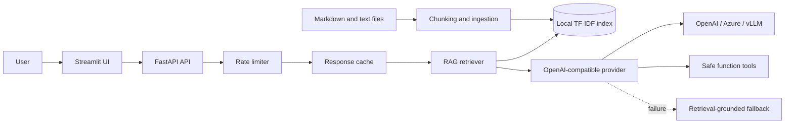

# Architecture

## Request flow

1. The API validates the request and applies a per-client sliding-window rate limit.
2. The service checks its TTL cache, retrieves the most relevant document chunks, and builds a grounded context.
3. The provider sends a structured JSON request with temperature, top-p, and function definitions. Transient provider failures retry with exponential backoff.
4. Tool calls are allow-listed and evaluated with safe functions. Provider or tool failures degrade to a context response rather than exposing an exception.
5. The response includes citations, provider state, cache state, and tool results for observability.

## Production evolution

The default local index is deliberately dependency-light. For larger corpora, replace `Retriever` with a persistent embedding/vector store such as pgvector, Qdrant, or Azure AI Search. For local model serving, point `OPENAI_BASE_URL` at a vLLM OpenAI-compatible server and set `CHAT_MODEL` to the served model.
